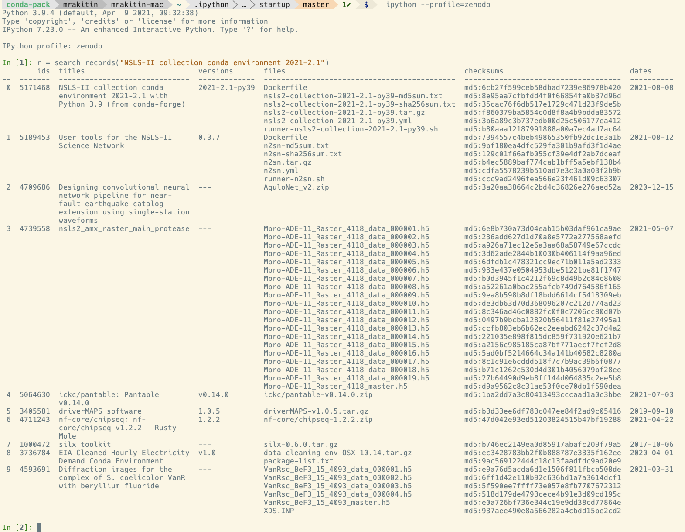

## IPython startup profile to search for data in Zenodo

This is a repo with IPython startup files to work with https://zenodo.org using
https://github.com/space-physics/pyzenodo3.

## Usage example:

```bash
$ mkdir ~/.ipython/
$ cd ~/.ipython/
$ git clone https://github.com/mrakitin/profile_zenodo.git
$ ipython --profile=zenodo

In [1]: r = search_records("NSLS-II collection conda environment 2021-2.1")
```


